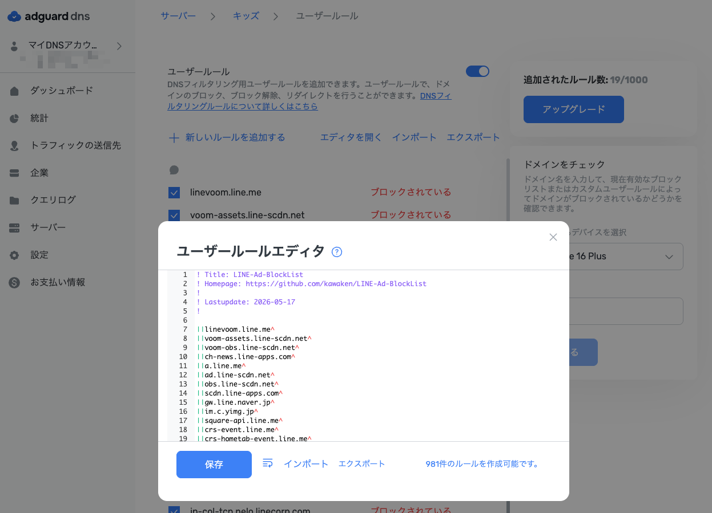

# LINE-Ad-BlockList
LINE広告・VOOM・ニュースをブロックするAdGuard DNS用ユーザールール

## 使い方

AdGuard DNSのサーバー設定にある「ユーザールール」に、このリポジトリのルールを追加してください。

1. [AdGuard DNS](https://adguard-dns.io/) にログイン
2. サーバー → ユーザールール → エディタを開く
3. ルールをコピー＆ペーストして保存

## 参考

- [minimal\-enginner/LINE\-Ad\-BlockList: LINE広告のブロックリスト（AdGuardHome用）](https://github.com/minimal-enginner/LINE-Ad-BlockList)
